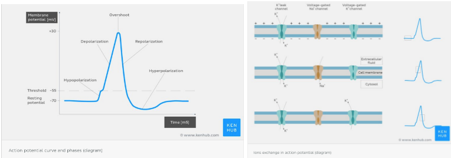

# Action Potential

The action potential is how neurons propagate electrical messages through itself and release neurotransmitters to communicate with other neurons. Neurons begin at a resting potential, which is about -70mV. When it receives a signal, it pushes the membrane potential above –55mV before the rest of the action potential can continue.his series of events is known as “all or nothing,” since the neuron will fire in direct correlation to the change in membrane potential. Computationally, this is described as a square function, as shown here: Once the threshold has been reached, the voltage gated sodium channels open, allowing sodium ions to flow into the neuron and further raise the membrane potential until it gets to its peak, about +35mV. This process is known as depolarization, as there is a loss of a substantial difference in the charges outside and inside of the membrane.After depolarization , the sodium ion channels close and the potassium voltage gated ion channels open, allowing potassium ions to flow out of the neuron, which is called repolarization. The potassium channel remains open long enough for the cell to reach resting potential again. This overshoot is known as hyperpolarization, after which the potassium channels finally close and the cell reaches its resting membrane potential again with the help of the leakage channels that are always open. This stage is called the refractory period, and the neuron cannot fire during it as the voltage gated sodium channels need time before they can open up again. When the action potential reaches the end of the axon, the vesicles or terminal buttons carrying neurotransmitters release them into the synaptic cleft, the area in between the presynaptic neuron and the postsynaptic neuron.

One way to remember where Na+ and K+ ions are relative to the neuron is by thinking of a banana in the ocean. The banana peel is the cell membrane and has a lot of potassium in it, while the ocean is really salty so the Na+ is outside the cell.